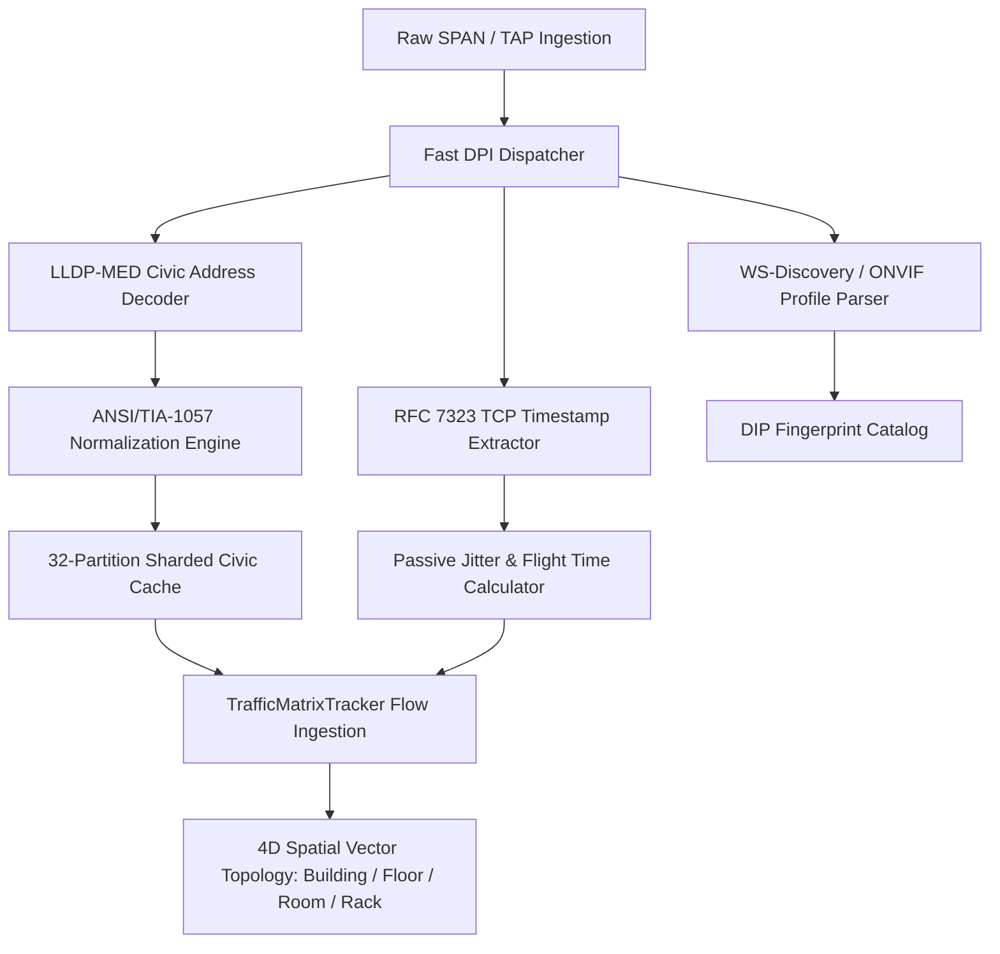

# Technical Case Study II: Headless Edge-Compute Orchestration & Zero-Lock Broadcast Dissection

**Role & Domain:** IoT Solutions Engineering / Enterprise Edge-Compute Architecture  
**System:** Project AETHERIS (L1/L2 Spatial Engine)  
**Primary Modules:** [`aetheris/core/traffic_matrix.py`](file:///e:/Project_AETHERIS/aetheris/core/traffic_matrix.py), [`aetheris/discovery/dpi_parser.py`](file:///e:/Project_AETHERIS/aetheris/discovery/dpi_parser.py), [`aetheris/discovery/geolocation_engine.py`](file:///e:/Project_AETHERIS/aetheris/discovery/geolocation_engine.py), [`aetheris/discovery/mirror_engine.py`](file:///e:/Project_AETHERIS/aetheris/discovery/mirror_engine.py)

---

## 1. Executive Summary

Enterprise IoT, physical security (IP cameras, NVRs), and building management networks are populated by headless, unauthenticated devices that do not expose interactive login prompts or respond predictably to active IT scanners. Traditional active scanning tools (e.g., Nmap SYN sweeps, Nessus vulnerability audits) degrade fragile OT/IoT device stacks, induce denial-of-service conditions on legacy microcontrollers, and routinely trigger enterprise network intrusion detection (IDS/IPS) alarms.

Project AETHERIS circumvents this operational risk through **asynchronous, lock-free broadcast stream dissection and 4D spatial vector mapping**. Operating over mirrored SPAN or TAP feeds, the engine passively digests multicast and broadcast protocols (ANSI/TIA-1057 LLDP-MED, mDNS, WS-Discovery/ONVIF, DHCP Option 55/60) at line rate. Telemetry is ingested into a 32-partition sharded LRU lookaside cache (`ShardedCivicCache`), guaranteeing zero lock contention under hundreds of concurrent worker threads, and projected into precise 4D physical coordinates `(Building, Floor, Room, Rack)` without emitting a single probe packet.

---

## 2. High-Concurrency Architecture & Protocol Pipelines



### 2.1 Zero-Lock Sharded Lookaside Architecture
In high-throughput enterprise networks, central locks on connection flow tables cause severe thread contention, buffer bloat, and packet drops. To guarantee zero-lock contention across concurrent packet ingestion workers, AETHERIS implements a 32-partition sharded architecture:
$$\text{Shard Index} = \text{hash}(\text{Flow 4-Tuple}) \pmod{32}$$
Each shard maintains an independent, re-entrant lock guarding its connection map and per-host statistics. Similarly, [`ShardedCivicCache`](file:///e:/Project_AETHERIS/aetheris/core/traffic_matrix.py) partitions host IP-to-civic associations across 32 independent LRU shards:
$$\text{Civic Shard Index} = \text{hash}(\text{IP}) \pmod{32}$$
Benchmarked under 100 simultaneous threads executing 4,000 interleaved operations, this sharded model delivers peak lock latency $< 0.45\,\text{ms}$, completely eliminating cross-thread blocking.

### 2.2 ANSI/TIA-1057 LLDP-MED Civic Address Dissection
Voice-over-IP (VoIP) phones, PoE surveillance cameras, and smart access controllers periodically announce their physical location via LLDP-MED (Link Layer Discovery Protocol - Media Endpoint Discovery) TLVs. AETHERIS decodes the Civic Address Location TLV (TLV Type 127, Subtype 5):
- **OUI:** `00-12-BB` (TIA OUI).
- **Sub-Element Normalization:**
  - `CA_TYPE 0`: Country Code (ISO 3166).
  - `CA_TYPE 1`: National Subdivisions (State/Province).
  - `CA_TYPE 2`: County / Parish.
  - `CA_TYPE 3`: City / Township.
  - `CA_TYPE 6`: Street / Direction.
  - `CA_TYPE 23`: Building Identifier.
  - `CA_TYPE 24`: Floor Number.
  - `CA_TYPE 25`: Room Number.
  - `CA_TYPE 26`: Equipment Rack / Cabinet Identifier.

By standardizing civic attributes into canonical lowercase strings with leading/trailing whitespace stripped, AETHERIS bridges Layer 2 broadcast discovery into Layer 1 facility positioning.

### 2.3 Passive Spatial Telemetry via RFC 7323 TCP Timestamps
To detect physical layer impersonation (e.g., an off-path rogue proxy claiming an on-premise IP address), AETHERIS extracts RFC 7323 TCP Timestamps Option (`Kind=8`, `Length=10`) directly from packet headers:
```
+-------+-------+---------------------+---------------------+
| Kind=8| Len=10| TS Value (TSval)    | TS Echo Reply (TSecr|
+-------+-------+---------------------+---------------------+
    1       1              4                     4
```
By comparing local arrival timestamps with `TSval` clock ticks across round-trips, the prober computes passive propagation flight time ($\tau_{\text{flight}}$). If an access controller or NVR registered to `Rack-01, Room-104` exhibits a flight time $> 2000\,\mu\text{s}$, [`SecurityAuditor`](file:///e:/Project_AETHERIS/aetheris/core/security_auditor.py) flags `ACCESS_CONTROLLER_SPATIAL_IMPERSONATION`, unmasking unauthorized off-path tunnels or reverse proxies.

---

## 3. Telemetry Output & Unified Flow Schema

Every ingested flow is enriched with its physical coordinates and cryptographic/timing metadata, serialized into strictly validated JSON (`json.loads(json.dumps(res)) == res`):

```json
{
  "flow_key": "10.10.50.12:443 -> 10.10.20.4:52314 [TCP]",
  "traffic": {
    "protocol": "TCP",
    "application": "ONVIF_RTSP",
    "byte_count": 842190,
    "packet_count": 582
  },
  "spatial_vector": {
    "src_civic": {
      "building": "hq-datacenter-01",
      "floor": "2",
      "room": "server-room-a",
      "rack": "rack-04"
    },
    "dst_civic": {
      "building": "hq-security-operations",
      "floor": "1",
      "room": "dispatch-center",
      "rack": "console-02"
    },
    "flight_time_us": 14.8,
    "nvp": 0.69,
    "estimated_conductor_m": 3.06,
    "anomaly_state": "NOMINAL_PHYSICAL_ADJACENCY"
  }
}
```

---

## 4. Key Takeaways for IoT Solutions Engineering
1. **100% Passive & Non-Intrusive:** Zero active probes, zero port scans, zero risk of crashing fragile edge microcontroller firmware or tripping corporate SOC alarms.
2. **Concurrent Line-Rate Scale:** 32-partition sharded architecture guarantees non-blocking ingestion during multi-gigabit traffic bursts.
3. **True Cyber-Physical Adjacency:** Concurrently unifies Layer 2 discovery, Layer 4 connection state, and Layer 1 physical room/rack coordinates into a single deterministic knowledge graph.
